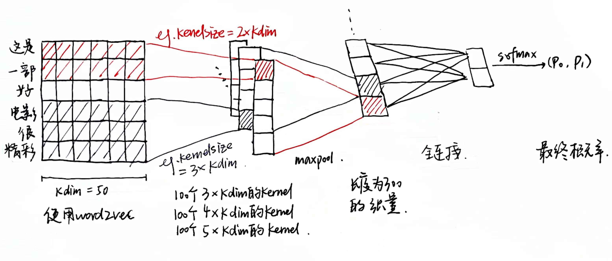
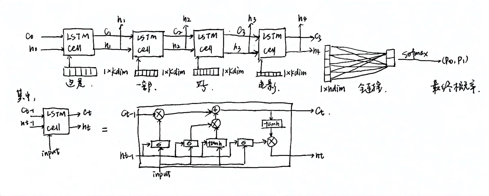
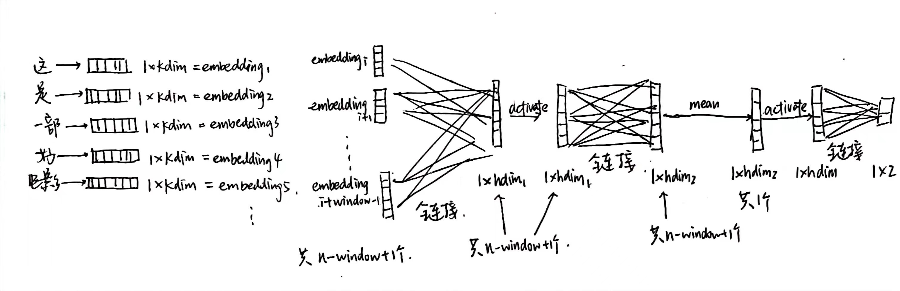

# 人智导 Lab2 二元情感分类实验报告

> 洪一宁 2020011022

## 0 网盘链接

https://cloud.tsinghua.edu.cn/d/dde6babcdba64b78aa83/

## 1 模型结构及流程分析

### 1.1 CNN

对于长度为 $n$ 的文本，通过 word2vec 得到大小为 $n\times kdim$ 的 embedding 张量，其中 $kdim = 50$。 

kernel_num 参数默认取100，经过 kernel_num 个 $3\times kdim$ 的卷积核，kernel_num 个 $4\times kdim$ 的卷积核和  kernel_num 个 $5\times kdim$ 的卷积核的计算后得到 kernel_num 个 $n - 2$ 长度的张量，kernel_num 个 $n - 3$ 长度的张量和 kernel_num 个 $n - 4$ 长度的张量。

对每个张量取 max，并拼接，得到一个长度为 $3\times kernel\_num$ 的张量。对这个张量应用 dropout。

经过全连接层，得到一个长度为 2 的张量，为最终结果。

### 1.2 RNN

对于长度为 $n$ 的文本，通过 word2vec 得到 $n$ 个大小为 $kdim$ 的 embedding 张量，其中 $kdim = 50$。 

按上图所示结构，将这 $n$ 个向量输入 LSTM cell，得到结果 $h_n \in \R^{1\times kdim}$。对这个张量应用 dropout。

上述结构stack为两层。

经过全连接层，得到一个长度为 2 的张量，为最终结果。

### 1.3 MLP

对于长度为 $n$ 的文本，通过 word2vec 得到 $n$ 个大小为 $kdim$ 的 embedding 张量，其中 $kdim = 50$。

对于每个区间 $embedding_i - embedding_{i + window - 1},\forall i = 1, 2, ...,n - window + 1 $，将 embedding 相连，压成一维，进行全连接，得到 $n - window + 1$ 个大小为 $1\times hdim_1$ 的张量。

对张量应用 Relu 激活函数，进行全连接，得到 $n - window + 1$ 个大小为 $1\times hdim_2$ 的张量。

将 $n - window + 1$ 个张量按第一维取平均值，得到一个大小为 $1\times hdim_2$ 的张量。

对张量应用 Relu 激活函数，进行全连接，得到一个二维张量，即为最终结果。

## 2 实验结果及参数分析

### 2.1 CNN

| dropout | batchsize | shuffle | optimizer | lr       | 核数    | 参数量  | acc              | prec             | recall           | F                | epoch | 总epoch |
| ------- | --------- | ------- | --------- | -------- | ------- | ------- | ---------------- | ---------------- | ---------------- | ---------------- | ----- | ------- |
| 0.3     | 50        | 1       | adam      | 1e-3     | 100     | 61k     | **0.829**        | **<u>0.812</u>** | 0.852            | 0.831            | 7     | 11      |
| 0.3     | 50        | **0**   | adam      | 1e-3     | 100     | 61k     | 0.493            | 0.493            | **<u>1.000</u>** | 0.661            | 6     | 10      |
| 0.3     | 50        | 1       | **SGD**   | **1e-2** | 100     | 61k     | 0.789            | 0.734            | **0.896**        | 0.807            | 28    | 30      |
| **0.1** | 50        | 1       | adam      | 1e-3     | 100     | 61k     | 0.824            | 0.780            | **0.896**        | 0.834            | 5     | 9       |
| **0.2** | 50        | 1       | adam      | 1e-3     | 100     | 61k     | 0.797            | 0.756            | 0.868            | 0.808            | 3     | 12      |
| **0.4** | 50        | 1       | adam      | 1e-3     | 100     | 61k     | **0.829**        | 0.779            | **0.912**        | **<u>0.841</u>** | 8     | 14      |
| 0.3     | **25**    | 1       | adam      | 1e-3     | 100     | 61k     | **0.829**        | 0.782            | **0.907**        | **0.840**        | 5     | 9       |
| 0.3     | **75**    | 1       | adam      | 1e-3     | 100     | 61k     | 0.821            | **0.809**        | 0.835            | 0.822            | 7     | 18      |
| 0.3     | 50        | 1       | adam      | **5e-4** | 100     | 61k     | **<u>0.835</u>** | **0.810**        | 0.835            | **0.838**        | 9     | 17      |
| 0.3     | 50        | 1       | adam      | **5e-3** | 100     | 61k     | 0.824            | 0.780            | **0.896**        | 0.834            | 4     | 8       |
| 0.3     | 50        | 1       | adam      | 1e-3     | **75**  | **46k** | 0.824            | **0.806**        | 0.846            | 0.826            | 7     | 11      |
| 0.3     | 50        | 1       | adam      | 1e-3     | **125** | **76k** | 0.821            | 0.790            | 0.868            | 0.827            | 6     | 12      |

第一行为 base 模型，仿照原论文设置初始参数。其余行加粗部分为修改的参数。

base 模型的 $accuracy = 0.829, precision = 0.812, recall = 0.852, F = 0.831$.

可以观察到，每轮 epoch 对数据进行 shuffle 有助于提高训练表现，对于此数据集（数据成规律性分布）尤为有效。

使用 adam optimizer 比 SGD optimizer 在相同 epoch 下效果更好。但由于算力有限，本次实验设置了 max-epoch=30，而 SGD optimizer 在第 30 个 epoch 时尚未收敛，因此无法判断继续训练将会有怎样的结果。

调整 dropout，发现效果变化不显著，推测可能是模型表示能力有限，不易过拟合导致的。

调整 batch size，发现效果变化不显著，说明 batch size 可能对效果影响不大。

调整初始 learning rate，发现learning rate 减半后效果更好，learning rate 翻倍后效果变化不显著，推测 base 使用的 learning rate 过大导致下降过快，难以达到全局最优解。

调整模型大小，模型变大或变小后效果略有下降，说明当前模型大小比较合适。

### 2.2 RNN

| dropout | batchsize | shuffle | optimizer | lr       | hdim   | 参数量  | acc              | prec             | recall           | F                | epoch | 总epoch |
| ------- | --------- | ------- | --------- | -------- | ------ | ------- | ---------------- | ---------------- | ---------------- | ---------------- | ----- | ------- |
| 0.3     | 50        | 1       | adam      | 1e-3     | 60     | 57k     | 0.846            | **<u>0.838</u>** | 0.852            | 0.845            | 18    | 26      |
| 0.3     | 50        | **0**   | adam      | 1e-3     | 60     | 57k     | 0.493            | 0.493            | **<u>1.000</u>** | 0.661            | 30    | 30      |
| 0.3     | 50        | 1       | **SGD**   | **1e-2** | 60     | 57k     | 0.767            | 0.767            | 0.758            | 0.762            | 29    | 30      |
| **0.1** | 50        | 1       | adam      | 1e-3     | 60     | 57k     | 0.832            | 0.806            | 0.868            | 0.836            | 14    | 30      |
| **0.2** | 50        | 1       | adam      | 1e-3     | 60     | 57k     | **0.848**        | 0.809            | **0.907**        | 0.855            | 17    | 23      |
| **0.4** | 50        | 1       | adam      | 1e-3     | 60     | 57k     | 0.843            | 0.823            | 0.868            | 0.845            | 21    | 25      |
| 0.3     | **25**    | 1       | adam      | 1e-3     | 60     | 57k     | 0.843            | **0.833**        | 0.852            | 0.842            | 14    | 22      |
| 0.3     | **75**    | 1       | adam      | 1e-3     | 60     | 57k     | 0.843            | 0.801            | **0.907**        | 0.851            | 18    | 30      |
| 0.3     | 50        | 1       | adam      | **5e-4** | 60     | 57k     | **<u>0.856</u>** | 0.831            | 0.890            | **<u>0.859</u>** | 30    | 30      |
| 0.3     | 50        | 1       | adam      | **5e-3** | 60     | 57k     | 0.832            | 0.803            | 0.874            | 0.837            | 6     | 12      |
| 0.3     | 50        | 1       | adam      | 1e-3     | **50** | **41k** | **0.854**        | **0.833**        | 0.879            | **0.856**        | 19    | 30      |
| 0.3     | 50        | 1       | adam      | 1e-3     | **70** | **74k** | **0.854**        | 0.827            | 0.890            | **0.857**        | 15    | 20      |

第一行为 base 模型，仿照 CNN 设置初始参数。其余行加粗部分为修改的参数。

base 模型的 $accuracy = 0.846, precision = 0.838, recall = 0.852, F = 0.845$.

可以观察到，每轮 epoch 对数据进行 shuffle 有助于提高训练表现，对于此数据集（数据成规律性分布）尤为有效。

使用 adam optimizer 比 SGD optimizer 在相同 epoch 下效果更好。但由于算力有限，本次实验设置了 max-epoch=30，而 SGD optimizer 在第 30 个 epoch 时尚未收敛，因此无法判断继续训练将会有怎样的结果。

调整 dropout，发现 dropout >= 0.2 时效果变化不显著，推测可能是模型表示能力有限，不易过拟合导致的。dropout 取 0.1 时模型效果略下降，可能出现过快过拟合问题。

调整 batch size，发现效果变化不显著，说明 batch size 可能对效果影响不大。

调整初始 learning rate，发现learning rate 减半后效果更好，learning rate 翻倍后效果更差，推测 base 使用的 learning rate 过大导致下降过快，难以达到全局最优解。

调整模型大小，模型变小后性能整体提升，说明原模型可能过大，或数据量过小，难以训练出 generalizable 的模型。

### 2.3 MLP

| 参数量 | accuracy | precision | recall | F     | epoch | 总epoch |
| ------ | -------- | --------- | ------ | ----- | ----- | ------- |
| 61k    | 0.756    | 0.721     | 0.824  | 0.769 | 12    | 23      |

MLP 模型作为 baseline，用于后续与上述两个模型进行对比。

实际实验中为使参数量与前两个模型的 base 大体保持一致，取 $window = 20, hdim1 = 57, hdim2 = 65$.

## 3 模型对比

对比三个模型的base：

| 模型           | 参数量 | accuracy | precision | recall | F     | epoch | 总epoch |
| -------------- | ------ | -------- | --------- | ------ | ----- | ----- | ------- |
| MLP (Baseline) | 61k    | 0.756    | 0.721     | 0.824  | 0.769 | 12    | 23      |
| CNN            | 61k    | 0.829    | 0.812     | 0.852  | 0.831 | 7     | 11      |
| RNN            | 57k    | 0.846    | 0.838     | 0.852  | 0.845 | 18    | 26      |

可以观察到，模型的效果 RNN 优于 CNN 优于 MLP，推测是因为 MLP 结构比较简单，模型空间比较局限；CNN 相比 MLP 能更加有效、显式地提取出 features；RNN 相比 CNN 使用了 LSTM，能更好的处理 sequence 信息。

从效率来看，在 一块 3050Ti GPU 上，三个模型单个 epoch 耗时均为约 28s，无显著区别。

## 4 问题思考

1. 实验训练什么时候停止是最合适的？简要陈述你的实现方式，并试分析固定迭代次数与通过验证集调整等方法的优缺点。

   理论上，实验的 training loss 应当不断下降，validation loss 先下降再上升（不断拟合直至过拟合）。应该在 validation loss 的最低点停止训练最合适。

   因此取 max_epoch = 30，同时采取 early stopping，若连续4个 epoch 的 validation_loss 上升或不变，则停止训练。训练结束后，采取 validation loss 最低的模型作为最终结果。

   固定迭代次数的优点是方便实现，缺点是容易过拟合，导致训练结果不好。

   通过验证集调整的优点是可以辨别出过拟合的模型，缺点是需要分出一部分数据用于验证，无法使用全部数据训练模型。

2. 实验参数的初始化是怎么做的？不同的方法适合哪些地方？（现有的初始化方法为零均值初始化，高斯分布初始化，正交初始化等）

   1. CNN 模型

      对于 CNN 模型，卷积核和全连接层均使用 Kaiming 均匀分布初始化（He 初始化），即一种零均值均匀分布初始化。

   2. RNN 模型

      对于 RNN 模型，$h_0, c_0$ 采用正态分布初始化（均值0，方差1）。LSTM 和全连接层均采用 Kaiming 零均值均匀分布初始化。

   3. MLP 模型

      对于 MLP 模型，全部采取零均值均匀分布初始化。

   正交初始化可以有效防止训练开始时梯度消失或梯度爆炸；高斯分布初始化可以使参数限于某一范围，固定参数的理论均值和方差；零均值初始化通过设定合适的区间，可以以很简单的方式达到很好的效果。

3. 过拟合是深度学习常见的问题，有什么方法可以防止训练过程陷入过拟合。

   使用dropout，使用 adam optimzer，使用L1/L2 norm，使用验证集选择最优模型，对 training data 进行 shuffle。

4. 试分析CNN，RNN，全连接神经网络（MLP）三者的优缺点。

   CNN：能够有效提取出 feature，并行计算效率高；对于依赖 sequence 中先后关系的一些 task 的处理效果不好，即难以处理先后序问题。

   RNN：能很好地处理序列中的先后问题，模型效果好；无法并行计算，效率低，尤其是对于长 sequence input。

   MLP：简单易实现；模型表示能力不强，可解释性差。

## 5 总结心得

通过完成三个模型的代码即训练，体会了神经网络的设计与实现，加深了对知识的认识、提高了功臣能力，加强了对人工智能的理解。

通过分析不同参数的作用，进一步体会到了不同方法在神经网络训练中的重要性。

由于时间、精力限制，未能进行更多参数的尝试。根据现有的结果，rnn部分仅通过调参应当还有上升空间。
